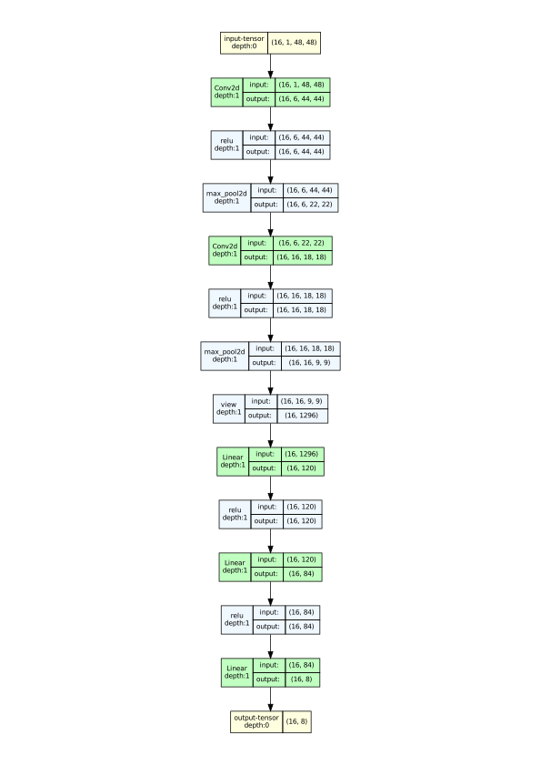
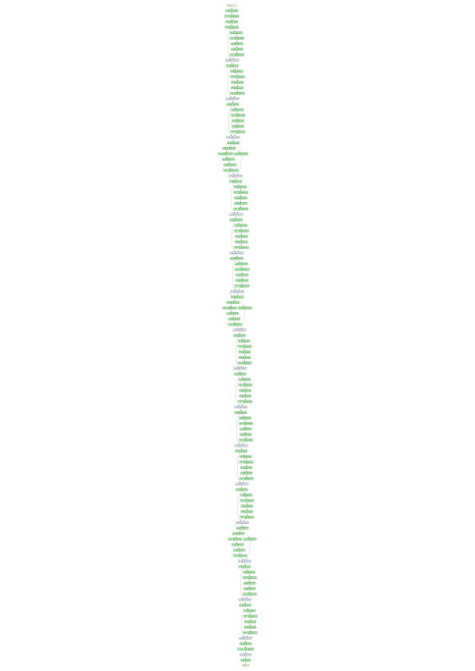
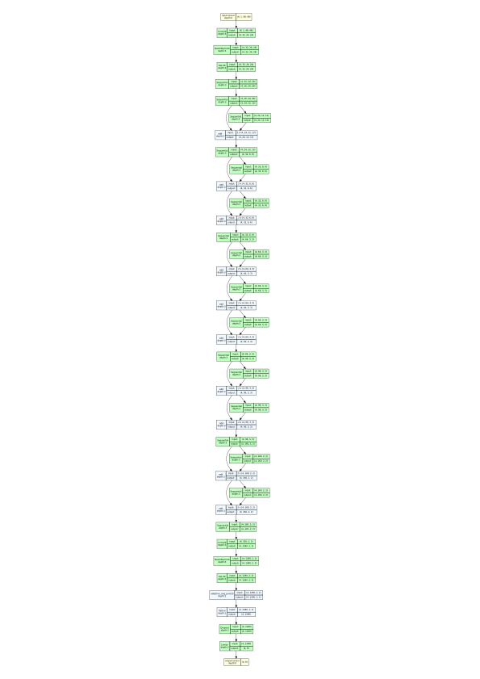

# Facial emotion recognition - Technical task
## Introduction
This Github repository contains the executable codes for facial recognition using FER and FER+ dataset. 
## Requirements
Please install the folloing packages for in order to run the codes. The packages are found in the requirements.txt. Please to install the package, just simply run:

```pip install -r requirements.txt ```

## Running the codes
To get all available arguments to run training, please use:

```python train.py --help```

In order to run training, please download the [FER+](https://github.com/microsoft/FERPlus) repository and the original [FER](https://www.kaggle.com/c/challenges-in-representation-learning-facial-expression-recognition-challenge/data) dataset. For FER+ dataset, please generate the image data using the python file [generate_training_data.py](https://github.com/microsoft/FERPlus/blob/master/src/generate_training_data.py) following the code instruction. 

To train any desire neural network, please run the ```train.py``` file with the desire arguments. For example, to train a ResNet 18 with the FER+ dataset (which in my code is multiple label classification) within 40 epochs with a batch size of 512 images, we run 

```python src/train.py --base_folder ferPlus2016/data --ferplus_path ferPlus2016/fer2013/fer2013new.csv --epochs 50 --saving_fn best_weights_resnet18_multi --model resnet18 --is_ferplus 1 --batch_size 512```

To use any trained model for inference of any image, take the following command as an example:

```python src/infere.py --image_fn path/to/image --saving_fn best_weights_resnet34_single --is_ferplus 0 --model resnet34```


## Architecture visualisations
Due to space and visualability of the architectures, I decide not to include theirs architecture inside the report. Hence, I show them here in the repository where we have more space and the view is also better.
### Lenet


### ResNet 18


### ResNet 34


### MobileNet v2


